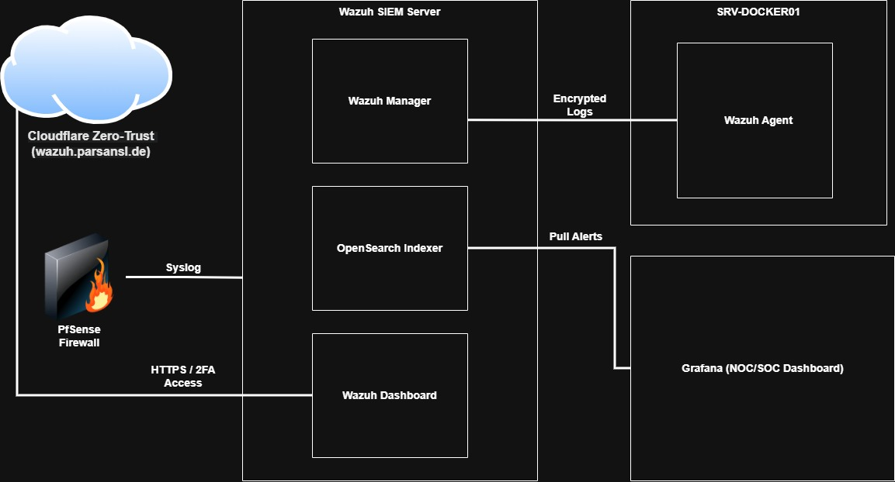
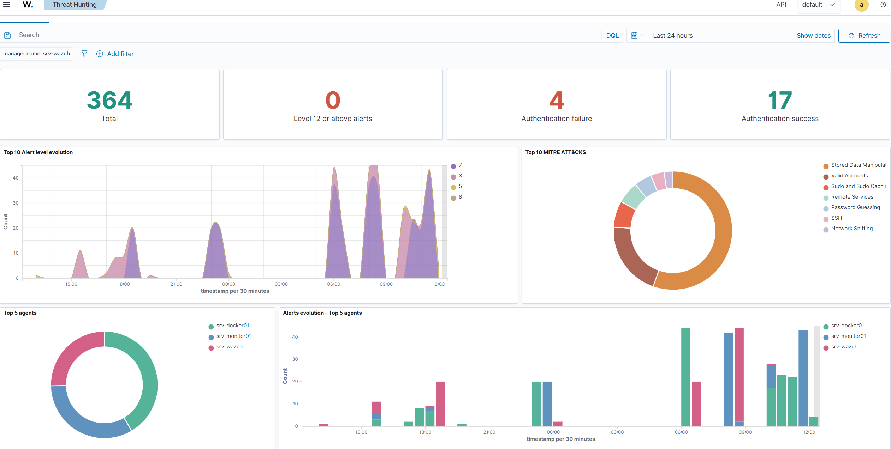
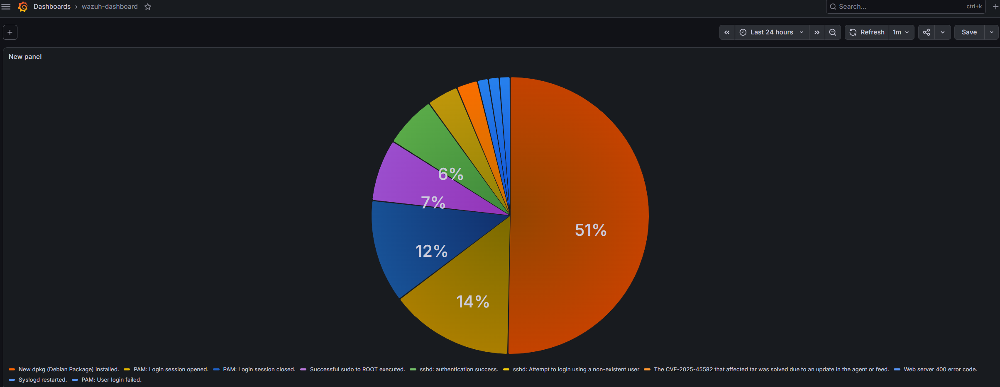
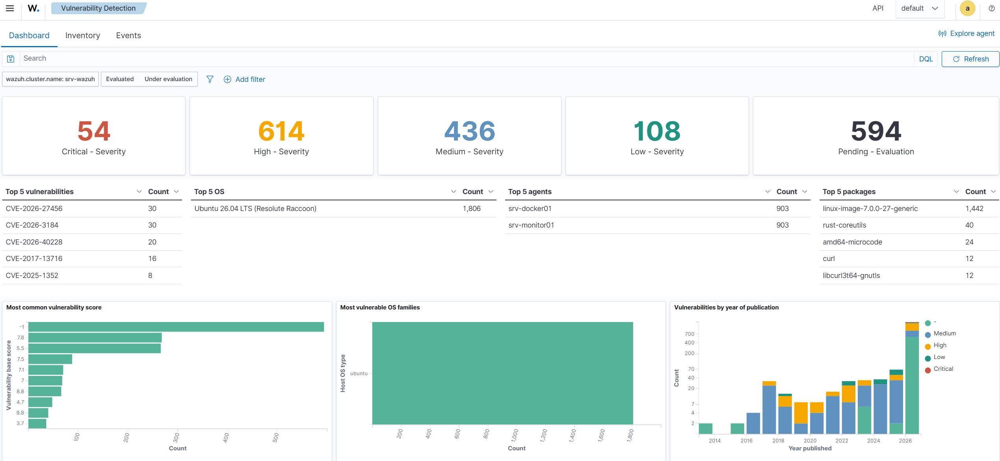

# Security Operations Center (SOC) & SIEM Integration (Wazuh)

Dieses Projekt dokumentiert den Aufbau eines vollständigen Security Operations Centers (SOC) zur proaktiven Erkennung und Abwehr von Cyberbedrohungen. Die Implementierung erfolgte nach strikten Zero-Trust-Prinzipien und die Dokumentation basiert auf der STAR-Methode.

## SIEM Architecture & Data Flow

Phase 1: Enterprise Security Monitoring & SIEM (Wazuh & Zero Trust)
Situation:
Die Netzwerkinfrastruktur und das Homelab (inklusive Docker-Services und System-Monitoring) waren erfolgreich implementiert und betriebsbereit. Es fehlte jedoch eine zentrale Verteidigungsschicht zur Bedrohungserkennung (Threat Detection) und zum Log-Management. Um den Enterprise-Sicherheitsstandards gerecht zu werden und die Infrastruktur vor unbefugten Zugriffen zu schützen, war der Aufbau eines Security Operations Center (SOC) erforderlich.

Task:
Die Implementierung eines Security Information and Event Management (SIEM) Systems basierend auf der Wazuh-Plattform. Die Hauptziele waren die Bereitstellung eines zentralen Servers zur Echtzeit-Verarbeitung von Sicherheits-Logs, die Einrichtung eines sicheren Remote-Zugriffs über eine Zero-Trust-Architektur und die Verteilung von Security-Agenten zur Überwachung der Endpunkte.

Action:

Ressourcenbereitstellung: Erstellung einer dedizierten virtuellen Maschine (Ubuntu 26.04 LTS) auf dem Proxmox-Hypervisor. Die Hardware wurde speziell für anspruchsvolle Datenbankprozesse optimiert (4 vCores x86-64-v2-AES für hardwarebeschleunigte Verschlüsselung, 8 GB RAM, 60 GB NVMe-Speicher).

Netzwerkkonfiguration & Deployment: Zuweisung einer statischen IP-Adresse im lokalen Netzwerk. Die Installation der Wazuh-Komponenten (Manager, Indexer, Dashboard) erfolgte automatisiert über den Wazuh Assistant Installer.

Implementierung von Cloudflare Zero Trust: Der Traffic zum Dashboard (wazuh.parsansl.de) wurde direkt über Cloudflare Tunnels geroutet. Es wurde eine strenge Access Policy konfiguriert, die den Zugriff ausschließlich über eine Zwei-Faktor-Authentifizierung (One-Time PIN per E-Mail) gestattet. Externe Ports auf der pfSense-Firewall blieben strikt geschlossen.

Agenten-Deployment: Der Wazuh-Agent (Architektur amd64) wurde erfolgreich auf dem Ubuntu-Docker-Server (srv-docker01) installiert und sicher mit dem zentralen Manager gekoppelt.

Result:
Ein vollständig einsatzbereites und stabiles SIEM-System wurde etabliert. Das zentrale Dashboard verarbeitet den Traffic nun verschlüsselt und ist durch eine undurchdringliche Zero-Trust-Identitätsschicht geschützt. Der Docker-Server ist erfolgreich im System registriert (Status: Active) und wird in Echtzeit auf Schwachstellen und sicherheitsrelevante Ereignisse überwacht.

** Threat Hunting Analysis:**

------------------------------------

Phase 2: Threat Hunting & Intrusion Detection Simulation
Situation:
Das SIEM-System (Wazuh) war erfolgreich in die IT-Infrastruktur integriert und der Linux-Docker-Server (srv-docker01) wurde aktiv überwacht. Um die Zuverlässigkeit des Systems in einem Ernstfall zu gewährleisten, musste die Erkennungsrate (Detection Rate) der Plattform anhand eines realistischen Angriffsszenarios validiert werden.

Task:
Die Durchführung und Analyse einer simulierten Cyberattacke (Brute-Force / Unauthorized Access) auf den überwachten Linux-Endpoint. Das Ziel war es, zu überprüfen, ob das SIEM-System den Angriff in Echtzeit erfasst, die Source-IP identifiziert und einen entsprechenden Sicherheitsalarm (Alert) generiert.

Action:

Angriffssimulation: Über das Terminal wurde ein gezielter SSH-Zugriffsversuch auf den Docker-Server (192.168.1.5) mit einem fiktiven Benutzernamen (hacker-test) initiiert. Es wurden absichtlich fehlerhafte Passwörter eingegeben, um eine Brute-Force-Aktivität zu simulieren, bis die Verbindung vom Linux-Server abgewiesen wurde (/var/log/auth.log).

Threat Hunting: Im zentralen Wazuh-Dashboard wurde das Modul "Threat Intelligence -> Threat Hunting" genutzt, um die eingehenden Logs proaktiv zu analysieren.

Log-Analyse: Mittels gezielter Suchabfragen (KQL - Kibana Query Language) wurden die generierten Alerts nach dem Angreifer-Muster gefiltert und ausgewertet.

Result:
Das SIEM-System hat die Angriffsversuche fehlerfrei und verzögerungsfrei erkannt. Im Dashboard wurden detaillierte Warnmeldungen (Alerts) mit hohen Prioritätsstufen generiert. Die Analyse der Logs zeigte präzise die Quell-IP-Adresse (data.srcip) des simulierten Angreifers sowie die genaue Beschreibung des Vorfalls (rule.description). Damit ist der Nachweis erbracht, dass das SOC-System voll funktionsfähig ist und Bedrohungen proaktiv erkennt.

------------------------------------

Phase 3: Enterprise SIEM Integration & Perimeter Security Monitoring (Wazuh & pfSense)
Situation:
Im Zuge des Aufbaus einer hochverfügbaren und sicheren Homelab-Infrastruktur fehlte eine zentrale Instanz zur Erkennung von Cyberbedrohungen und Richtlinienverstößen (Security Operations Center - SOC). Die heterogene Umgebung, bestehend aus Linux-Docker-Endpunkten und einer zentralen pfSense-Firewall, lief in getrennten Subnetzen. Ohne ein SIEM-System gab es keine Möglichkeit, sicherheitsrelevante Ereignisse wie unbefugte Zugriffversuche, Brute-Force-Attacken oder Konfigurationsänderungen netzwerkweit in Echtzeit zu korrelieren und zu analysieren.

Task:
Die primäre Aufgabe war die Implementierung einer zentralen, skalierbaren SIEM-Plattform auf Basis von Wazuh. Das System musste so konfiguriert werden, dass es sowohl agentenbasierte (Linux-Endpoints) als auch agentenlose (pfSense via Syslog) Protokolle sicher empfangen kann. Dabei galten strengste Sicherheitsvorgaben (Zero Trust): Die Log-Übertragung durfte keine neuen Angriffsvektoren oder offenen Ports nach außen öffnen, und der SIEM-Server musste durch restriktives IP-Whitelisting vor unbefugter Log-Injektion geschützt werden.

Action:

Server-Bereitstellung & Härtung: Aufsetzen einer dedizierten virtuellen Maschine (Ubuntu Server) im Proxmox VE-Cluster mit optimierter Ressourcenallokation für die Ausführung des Wazuh-Managers, OpenSearch-Indexers und des Web-Dashboards.

Agentenbasierte Integration (Linux-Monitoring): Zentraler Rollout des Wazuh-Agents auf dem Docker-Host (srv-docker01). Konfiguration des Dienstes zur kontinuierlichen Überwachung kritischer Systemdateien (z.B. /var/log/auth.log) und Systemaufrufe.

Agentenlose Firewall-Anbindung (Cross-Subnet Syslog):

SIEM-Seitig (ossec.conf): Aktivierung des Syslog-Listeners auf dem Standardport. Implementierung eines strikten IP-Filters mittels <allowed-ips>, sodass ausschließlich Log-Pakete aus dem vertrauenswürdigen internen Netzbereich akzeptiert und verarbeitet werden.

Firewall-Seitig (pfSense): Aktivierung des Remote-Loggings und Bindung des Syslog-Daemons an das interne LAN-Interface, um Routing-Konflikte zwischen den Subnetzen zu eliminieren. Das Logging-Niveau wurde auf "Everything" skaliert.

Live-Netzwerkanalyse & Validierung: Einsatz von Paketsniffer-Tools (tcpdump) auf dem SIEM-Server zur Überprüfung des einströmenden UDP-Datenstroms, um die erfolgreiche Kommunikation über Subnetzgrenzen hinweg zu beweisen.

Kontrollierte Angriffssimulation: Durchführung eines simulierten Brute-Force-Angriffs über ein externes Terminal mittels SSH-Zugriffsversuchen unter Verwendung eines ungültigen Benutzers (hacker-test).

Result:
Das SIEM-System läuft fehlerfrei und fängt alle sicherheitsrelevanten Ereignisse der Infrastruktur zentral ab. Die Angriffssimulation wurde vom Wazuh-Manager in Echtzeit korreliert. Im Threat Hunting Modul wurden die "Authentication Failures" sofort mit hoher Priorität ausgewiesen. Die extrahierten JSON-Rohdaten identifizierten präzise die Quell-IP des Angreifers (data.srcip), den missbrauchten Benutzernamen (data.srcuser) und die Log-Quelle. Die Infrastruktur beweist damit die proaktive Erkennungsfähigkeit von Anomalien.

------------------------------------

Phase 4: Forgiving IPS & Smart Whitelisting (Wazuh Active Response)
Situation:
Das SIEM-System protokollierte Sicherheitsvorfälle (wie z.B. SSH Brute-Force) erfolgreich. Um die Reaktionszeit bei echten Angriffen auf null zu reduzieren, musste ein Intrusion Prevention System (IPS) aktiviert werden. Die Herausforderung in einer modernen, VPN-gestützten Infrastruktur (Tailscale) und einer Multi-Subnetz-Umgebung besteht jedoch darin, legitime administrative Zugriffe niemals versehentlich auszusperren (Self-Lockout), selbst bei fehlerhaften Login-Versuchen.

Task:
Implementierung eines "Forgiving IPS" (tolerantes Intrusion Prevention System). Ziel war es, automatisierte Sperren (firewall-drop) für externe Angreifer zu aktivieren, während alle kritischen Infrastruktur-Knoten (Hypervisor, Firewall-Gateways) sowie das gesamte administrative VPN-Subnetz durch eingranulares "Smart Whitelisting" dauerhaft geschützt bleiben.

Action:

Smart Whitelisting-Architektur: In der globalen Konfiguration des Wazuh-Managers (ossec.conf) wurden spezifische <white_list>-Einträge erstellt. Anstatt ganze LAN-Segmente unsicher freizugeben, wurden exakt die IP-Adressen der Management-Interfaces (Proxmox: [HYPERVISOR_IP], pfSense: [FW_MGT_IP], pfSense-Gateway: [FW_LAN_GW]) sowie das streng authentifizierte VPN-Tunnel-Netzwerk ([VPN_SUBNET]/10) definiert.

Forgiving IPS Konfiguration: Das Active-Response-Modul wurde für SSH-Angriffe konfiguriert. Um permanente Sperren bei menschlichen Fehlern zu vermeiden, wurde ein Timeout gesetzt.

Automatisierte Ausführung: Der Wazuh-Manager instruiert bei einem Regelverstoß den lokalen Agenten, die Quell-IP des Angreifers dynamisch über die Linux iptables (bzw. UFW) des Endpoints zu blockieren.

Result:
Das SIEM fungiert nun als dynamisches Schutzschild. Automatisierte Angreifer werden sofort und ohne manuelles Eingreifen für 5 Minuten auf Kernel-Ebene blockiert, was Brute-Force-Attacken technologisch und zeitlich unmöglich macht. Gleichzeitig ist durch das präzise Whitelisting garantiert, dass der administrative Fernzugriff über das VPN unter keinen Umständen durch das IPS unterbrochen wird. Die Infrastruktur kombiniert nun höchste Sicherheit mit maximaler administrativer Verfügbarkeit.

------------------------------------

Phase 5: File Integrity Monitoring (FIM) in Echtzeit
Situation:
Eine der häufigsten Taktiken von Angreifern nach einer erfolgreichen Systemkompromittierung (Post-Exploitation) ist das Platzieren von Backdoors, Web Shells oder das Modifizieren von kritischen Systemdateien. Um solche unbefugten Dateiänderungen sofort zu erkennen, reichte eine reine Netzwerküberwachung nicht aus. Es wurde ein Mechanismus auf Host-Ebene benötigt.

Task:
Die Implementierung eines File Integrity Monitoring (FIM) Systems auf dem produktiven Docker-Endpunkt. Ziel war es, sensible Verzeichnisse in Echtzeit (Real-time) kryptografisch zu überwachen, sodass jede Erstellung, Änderung oder Löschung von Dateien sofort einen Sicherheitsalarm im zentralen SIEM-Dashboard auslöst.

Action:

Agenten-Konfiguration (ossec.conf): Auf dem Linux-Endpunkt (srv-docker01) wurde das <syscheck>-Modul des Wazuh-Agenten konfiguriert.

Echtzeit-Überwachung: Ein dediziertes Sicherheitsverzeichnis (/security-test) wurde in die Überwachung aufgenommen. Die Parameter check_all="yes" (Prüfung von Inhalt, Berechtigungen und Hash-Werten) sowie realtime="yes" (sofortige Inotify-basierte Alarmierung statt periodischer Scans) wurden aktiviert.

Penetrationstest (Log-Injection): Um die Funktionalität zu validieren, wurde ein unbefugter Schreibzugriff simuliert, indem eine neue Textdatei (secret.txt) mit Root-Rechten in das überwachte Verzeichnis injiziert wurde.

Result:
Das FIM-Modul detektierte den Dateizugriff verzögerungsfrei. Im Wazuh-Dashboard (Endpoint Security) wurde der Vorfall exakt dokumentiert: Die Aktion (Added), der betroffene Pfad, der Zeitstempel sowie der ausführende Benutzer (root) wurden präzise identifiziert. Damit ist sichergestellt, dass unbefugte Manipulationen an der Infrastruktur sofort erkannt und forensisch nachverfolgt werden können.

------------------------------------

Phase 6: Unified NOC/SOC Dashboard & Zero-Trust Database Integration
Situation:
In komplexen Enterprise-Umgebungen ist es ineffizient, Systemressourcen (Hardware-Monitoring) und Security-Alerts (SIEM) in getrennten Dashboards zu überwachen. Ein "Single Pane of Glass" (zentrales Dashboard) wurde benötigt. Die kritische Herausforderung bestand darin, das externe Monitoring-System (Grafana) an die Wazuh-Datenbank (OpenSearch) anzubinden, ohne den sensiblen Datenbank-Port (9200) für das restliche Netzwerk angreifbar zu machen oder die Funktion des lokalen Wazuh-Web-Dashboards zu stören.

Task:
Sichere Integration der Wazuh-Indexer-Datenbank in Grafana zur Erstellung eines kombinierten NOC/SOC-Dashboards. Dabei musste das Prinzip des "Zero Trust" auf Netzwerkebene strikt angewendet werden, um unbefugte Zugriffe auf die Security-Logs algorithmisch auszuschließen.

Action:

Datenbank-Exposition (Binding): Die Konfiguration opensearch.yml wurde modifiziert (network.host: 0.0.0.0), um den Indexer für externe Abfragen über die Netzwerkschnittstelle empfangsbereit zu machen.

Zero-Trust Firewall-Architektur (Host-based): Um den exponierten Port abzusichern, wurden strikte, priorisierte iptables-Regeln auf dem SIEM-Server implementiert:

Globale DROP-Regel für alle eingehenden TCP-Verbindungen.

Granulare ACCEPT-Ausnahmen ausschließlich für den Grafana-Server ([MONITORING_IP]), die Loopback-Adresse (127.0.0.1 zur Erhaltung des lokalen Dashboards) sowie die eigene Server-IP.

Grafana Data Source & Visualisierung: In Grafana wurde OpenSearch als Datenquelle (https://[SIEM_IP]:) via TLS/SSL angebunden. Unter Verwendung der Index-Pattern wazuh-alerts-* und der Aggregation des Feldes rule.description.keyword wurde ein interaktives Pie-Chart zur Echtzeit-Analyse der Bedrohungslandschaft erstellt.

Result:
Die Integration war vollständig erfolgreich. Grafana ruft nun in Echtzeit Sicherheitswarnungen aus dem SIEM ab und visualisiert die Verteilung der Angriffsvektoren. Durch die Implementierung der Kernel-Level Firewall-Regeln ist die Datenbank kryptografisch und netzwerktechnisch zu 100 % gegen unbefugte Scans geschützt, während die administrative Überwachung reibungslos in einem zentralen Dashboard zusammenläuft.

** Unified NOC/SOC Visualisation (Grafana):**

------------------------------------

Phase 7: Automated Vulnerability Assessment & Patch Management (Wazuh)
Situation:
Neben der Erkennung von aktiven Angriffen (IDS/IPS) ist die präventive Schließung von Sicherheitslücken ein kritischer Bestandteil der IT-Sicherheit. In der Infrastruktur liefen verschiedene Linux-Server (Ubuntu), deren installierte Softwarepakete (z.B. Kernel, Curl, Libraries) im Laufe der Zeit veralten und bekannte Schwachstellen (CVEs - Common Vulnerabilities and Exposures) aufweisen können. Ein manuelles Überprüfen aller Pakete auf allen Servern ist in einer Enterprise-Umgebung nicht skalierbar.

Task:
Aktivierung und Nutzung des Wazuh Vulnerability Detector Moduls. Ziel war es, eine automatisierte, kontinuierliche Schwachstellenanalyse für alle angebundenen Endpunkte (Agents) durchzuführen, um verwundbare Softwarepakete in Echtzeit zu identifizieren und nach Schweregrad (Kritisch, Hoch, Mittel) zu priorisieren.

Action:

Vulnerability Detector Konfiguration: Das Modul zur Schwachstellenerkennung wurde im Wazuh-Manager aktiviert. Wazuh gleicht dabei die Software-Inventardaten der Endpunkte automatisch mit den globalen OVAL-Datenbanken (Canonical/Ubuntu) sowie der National Vulnerability Database (NVD) ab.

System-Audit: Das System führte einen globalen Scan der Server (z.B. srv-docker01, srv-monitor01) durch und korrelierte die installierten Paketversionen (z.B. linux-image, curl) mit den aktuellen CVE-Feeds.

Patch Management (Remediation): Basierend auf dem Dashboard-Report wurde ein gezielter Patch-Prozess initiiert (apt update && apt upgrade), um die identifizierten Pakete auf den Zielservern zu aktualisieren und die Angriffsfläche zu minimieren.

Result:
Die Infrastruktur verfügt nun über ein automatisiertes Vulnerability Management. Das Security-Team hat jederzeit einen zentralen Überblick über veraltete Pakete und ungeschlossene CVEs. Durch die präzise Identifikation der verwundbaren Software (bis auf Paket-Ebene) kann das Patch-Management effizient gesteuert werden, was die proaktive Sicherheit der gesamten Serverlandschaft massiv erhöht.

** Vulnerability Detector Dashboard:**

